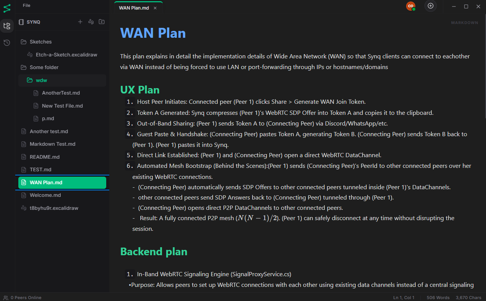
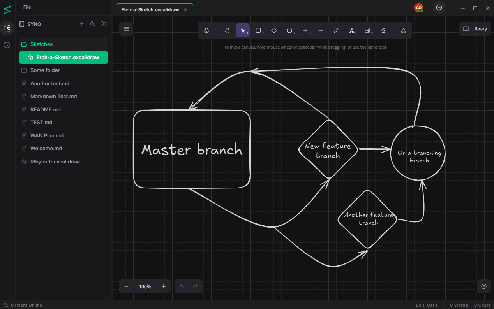

<div align="center">
  
  <h1>Synq</h1>
</div>

> A high-performance, local-first markdown editor and peer-to-peer knowledge workspace with zero server dependencies.


[](https://github.com/coatmol/Synq/actions/workflows/release.yml)
[](https://github.com/coatmol/Synq/actions/workflows/release.yml)
[](https://github.com/coatmol/Synq/actions/workflows/release.yml)

**Synq** is a zero-trust, local-first markdown editor and personal knowledge base built for absolute data sovereignty. Designed for taking interconnected notes and managing large collections of markdown documents locally, Synq gives you full ownership over your thoughts in plain text—with zero telemetry, zero tracking, and no required accounts.

Instead of relying on a centralized database or cloud backend to resolve concurrent edits between devices, Synq implements a custom Conflict-Free Replicated Data Type (CRDT) engine in C#. Nodes (your devices) discover each other automatically on local networks, establish direct peer-to-peer socket connections, and merge state changes deterministically. Your data never leaves your machine, ensuring your private notes remain entirely insulated from corporate cloud providers and data harvesting.

---

## 📸 Screenshots

<div align="center">
  
  
</div>

---

## 🗝️ Key Features

* **Absolute Privacy & Data Sovereignty:** Your data is completely air-gapped from the cloud. No analytics, no telemetry, no mandatory sign-ups, and no middleman servers.
* **Advanced Markdown Editor:** A frictionless, focused writing environment with robust support for markdown, bi-directional linking, LaTeX math, and networked thought organization.
* **Visual Whiteboarding:** Native integration with Excalidraw allows you to create diagrams, sync them locally, and seamlessly embed them as live, interactive SVGs directly into your markdown notes.
* **Zero-Server Architecture:** No central database, backend API, or cloud service required. The client *is* the server.
* **Homelab Server Node:** Deploy Synq as an always-on container on your NAS or homelab to provide a 24/7 persistent peer, complete with a functional Web UI for remote access.
* **Deterministic Conflict Resolution:** Mathematical guarantees ensure all peers eventually converge on the exact same document state regardless of network latency, packet reordering, or offline duration.
* **Offline-First Storage:** Local-first state persistence backed by a lightweight file-system database. You retain 100% ownership of your data offline.
* **Zero-Configuration Discovery:** Automatic peer discovery across local Wi-Fi and LAN networks using Multicast DNS (mDNS).
* **Built-in Version Control:** Native versioning system that tracks changes and allows you to restore previous versions of your documents.

---

## 🖥️ System Architecture

Synq operates as a strictly local peer-to-peer system. Each running instance of the app hosts an embedded ASP.NET Core process running on `localhost`. The React front-end is completely isolated and never touches the external internet—it communicates exclusively with its local host process over HTTP/WebSockets. The host manages all peer discovery, markdown file I/O, and raw TCP socket streaming strictly between your local network devices, completely bypassing internet relays that could otherwise collect network metadata.

---

## 🛠️ Tech Stack

Synq leverages a powerful set of modern tools to deliver high performance without sacrificing local-first principles:
- **Backend/P2P Engine:** C#, ASP.NET Core, Custom CRDT Engine
- **Network Discovery:** Multicast DNS (mDNS) & WebRTC (WAN)
- **Frontend App:** React, Vite, TailwindCSS, HeroUI (NextUI)
- **Whiteboarding:** Excalidraw integration

---

## 🤔 Why Synq?

* **Vs. Obsidian/Logseq:** While these are fantastic local-first tools, real-time syncing across devices without a third-party cloud service (like iCloud, Dropbox, or a paid Sync subscription) is difficult. Synq's CRDT engine guarantees seamless, true peer-to-peer sync out of the box with zero configuration or cloud dependencies.
* **Vs. Notion/Anytype:** Synq doesn't lock you into a proprietary block-based database format. Everything you write is saved as standard `.md` files in a standard folder hierarchy. Your data remains perfectly portable.

---

> Disclaimer: Synq has not yet been tested with a big number of people. While the CRDT engine guarantees eventual consistency, you may experience unexpected edge cases in high-latency or highly-concurrent WAN environments.
> Synq does have a built-in version control system eitherway.
---

## 📖 Documentation

For a detailed FAQ on how to connect peers over LAN and the Internet, as well as a Markdown cheat sheet, please check out the [User Guide](GUIDE.md).

---
## 🚀 Installation & Downloads

Synq is available in two distinct flavors: the full **Desktop Application** for your daily driver devices, and a **Server Node** for your homelab or NAS.

### 1. Desktop Application
#### 📦 Pre-compiled Releases (Recommended)
You can download the latest installers and portable binaries directly from the **[GitHub Releases Page](https://github.com/coatmol/Synq/releases/latest)**.

| OS | Download Type | Filename Format |
| :--- | :--- | :--- |
| **Windows** | Setup Installer | `Synq-Windows-Setup.exe` |
| **macOS** | DMG Installer | `Synq-macOS-Setup.dmg` |
| **Linux** | AppImage / DEB | `Synq-Linux-Setup.AppImage` |

> *Note: Portable `.zip` archives are also available for all platforms if you prefer a no-install experience—just extract and run!*

#### 💻 Build from Source
To run the desktop application from source, ensure you have the [.NET SDK](https://dotnet.microsoft.com/download) and [Bun](https://bun.sh/) installed:

```bash
git clone https://github.com/coatmol/Synq.git
cd Synq
dotnet run --project src/Desktop
```

---

### 2. Server Node (For Homelabs)
A lightweight, always-on peer designed specifically for the self-hosting community. It runs the exact same CRDT sync engine as the desktop client, providing a 24/7 highly-available backup target on your network. While the native desktop client is strongly recommended for the best experience, the Server Node also serves a fully functional Web UI that you can access from any browser.

#### 🐳 Docker (Recommended)
Synq Server is fully containerized and hosted on the GitHub Container Registry. 

```bash
docker run -d \
  --name synq-server \
  --network host \
  --restart unless-stopped \
  -v ~/synq-vault/:/data \
  -e folder=/data \
  -e port=5000 \
  -e password="your_optional_secure_password" \
  ghcr.io/coatmol/synq:latest
```

> **Important Docker Notes:**
> - `--network host` is highly recommended to allow the mDNS discovery engine to find local peers automatically.
> - The `password` environment variable is completely optional, but strongly recommended if you intend to expose the server port outside of your local network.

#### 📦 Pre-compiled Binaries
Standalone headless binaries are available for Windows, macOS, and Linux. Download the `Synq-Server-*` `.zip` from the **[Releases Page](https://github.com/coatmol/Synq/releases/latest)**.

#### 💻 Build from Source
```bash
git clone https://github.com/coatmol/Synq.git
cd Synq

# Configure your target directory where notes will be saved
export folder=/home/user/notes
dotnet run --project src/Server
```

---

## 🤝 Contributing

Synq is fully open-source and welcomes contributions! Whether you're fixing a bug, adding a new feature, or improving documentation, your help is appreciated. 
Please read our **[Contributing Guidelines](CONTRIBUTING.md)** to get started. Feel free to open a Pull Request or browse the existing issues.

## 💬 Community

Have a question, need help with a complex network setup, or want to suggest a new feature? 
Check out the **[GitHub Discussions](https://github.com/coatmol/Synq/discussions)** or open an issue on the repository to get in touch with the community!